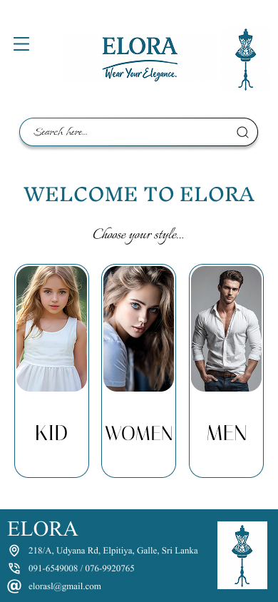
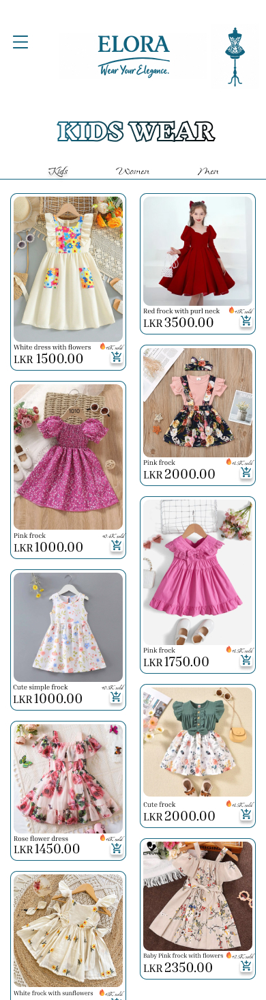
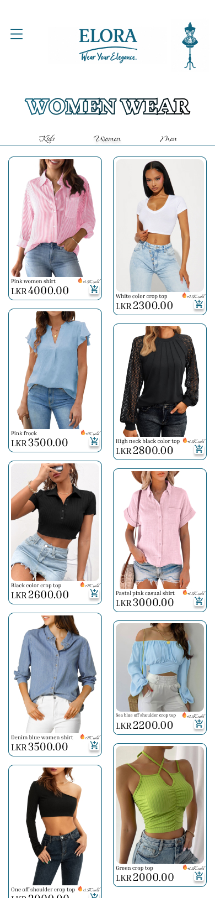
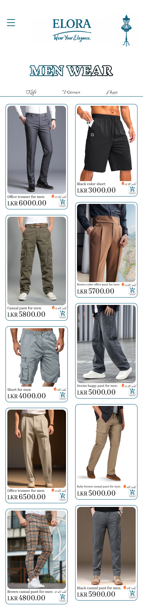
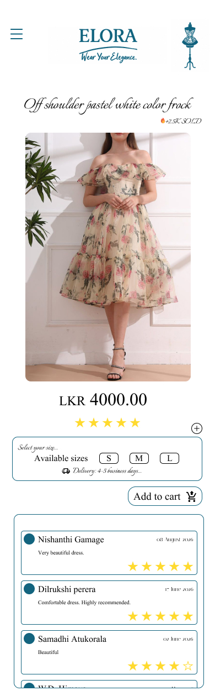
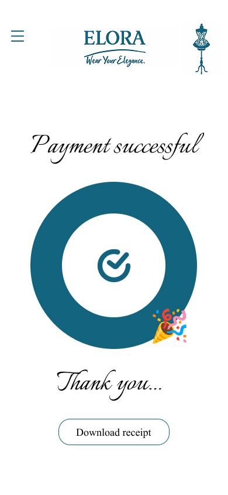
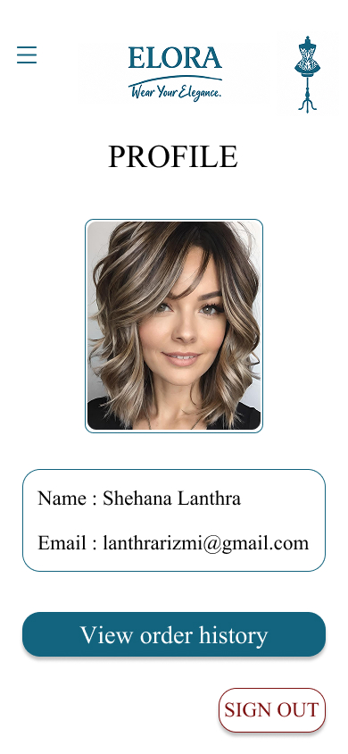
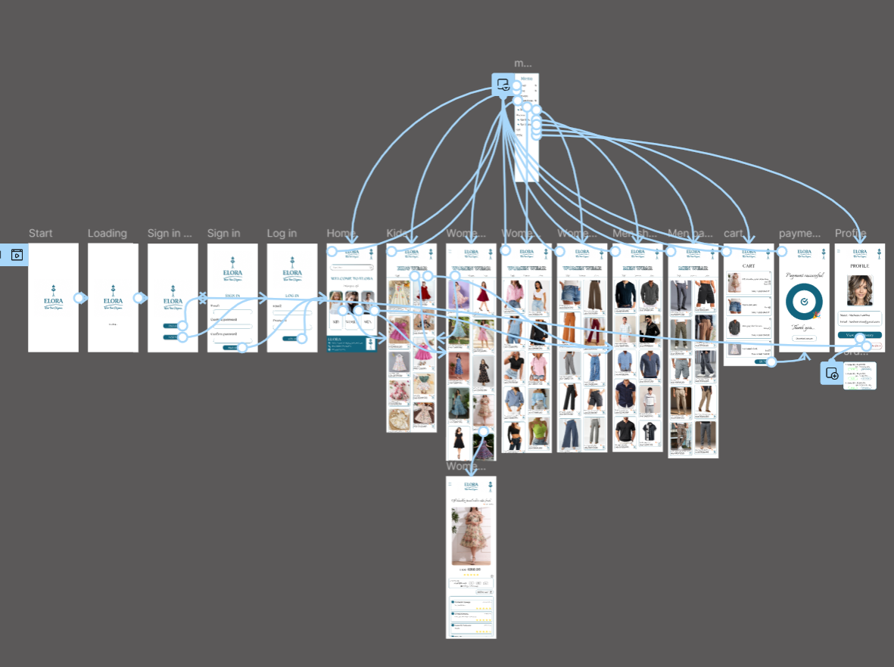

# 💙 ELORA — Fashion Shopping App

**ELORA** is a luxury-inspired fashion shopping app UI/UX project designed and prototyped entirely in **Figma**. The app provides a modern and elegant shopping experience for **women, men, and kids**.

---

## ✨ Project Overview

ELORA was designed with a **fancy and elegant visual style**, using **blue as the main color theme**.

The main goal of the project was to create a smooth and visually appealing shopping experience, from browsing clothing items to completing the checkout and payment process.

---

## 🛍️ Main Features

* 🔐 Login & Sign Up
* 🏠 Home Dashboard
* 🔎 Product Search
* 👗 Women's Clothing

  * Women's Frocks
  * Women's Pants
  * Women's Shirts
* 👔 Men's Clothing

  * Men's Shirts
  * Men's Trousers
* 🧸 Kids' Clothing
* 🛒 Shopping Cart
* 💳 Checkout
* ✅ Payment Successful Confirmation
* 👤 User Profile
* 🚪 Sign Out
* 🔄 Fully Interactive Figma Prototype

---

## 🎨 Design

| Category          | Details                                |
| ----------------- | -------------------------------------- |
| **Design Tool**   | Figma                                  |
| **Design Style**  | Luxury / Modern / Elegant              |
| **Primary Color** | Blue                                   |
| **Platform**      | Mobile Shopping App                    |
| **Focus**         | UI/UX Design & Interactive Prototyping |

---

## 📱 Screenshots

### 🏠 Home Dashboard

The home dashboard provides access to the main clothing categories and includes a search bar for finding products.

---

### 🧸 Kids Wear

The Kids Wear section allows users to browse clothing products designed for children.

---

### 👗 Women's Wear

The Women's Wear section includes different clothing categories such as dresses, pants, and shirts.

---

### 👔 Men's Wear

The Men's Wear section provides clothing options such as shirts and trousers.

---

### 🛍️ Product Details

Users can view individual clothing items before adding them to their shopping cart.

---

### 💳 Payment Successful

A payment confirmation screen is displayed after successfully completing the checkout process.

---

### 👤 User Profile

The profile section allows users to access and manage their account information.

---

### 🔄 Interactive Prototype

The ELORA prototype is fully connected in Figma, allowing users to navigate through the complete shopping flow.

---

## 🔗 Prototype

The prototype includes interactive navigation between the main screens, allowing users to:

**Login / Sign Up → Browse Categories → Search Products → View Items → Add to Cart → Checkout → Payment Confirmation**

---

## 🎯 UX Focus

The project focuses on:

* Simple and intuitive navigation
* Clear product categorisation
* Consistent visual design
* Smooth shopping flow
* User-friendly interactions
* Modern and elegant fashion aesthetics

---

## 🛠️ Tools Used

* **Figma** — UI Design & Prototyping
* **GitHub** — Project Documentation & Version Control

---

## 👩‍💻 Designer

**Shehana Rizmi Lanthra**

Computer Science Undergraduate | UI/UX Designer | Product Design Enthusiast

---

⭐ **Thank you for checking out ELORA!**
